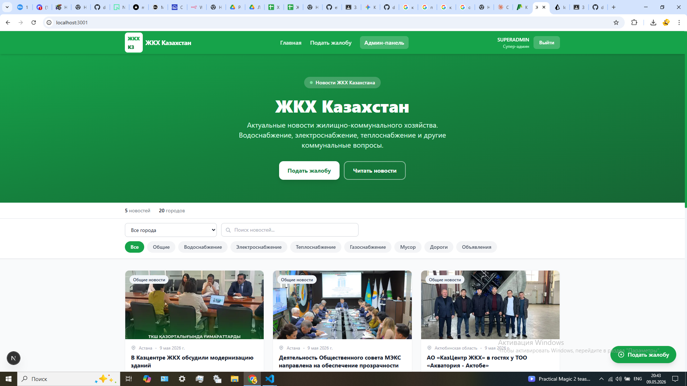
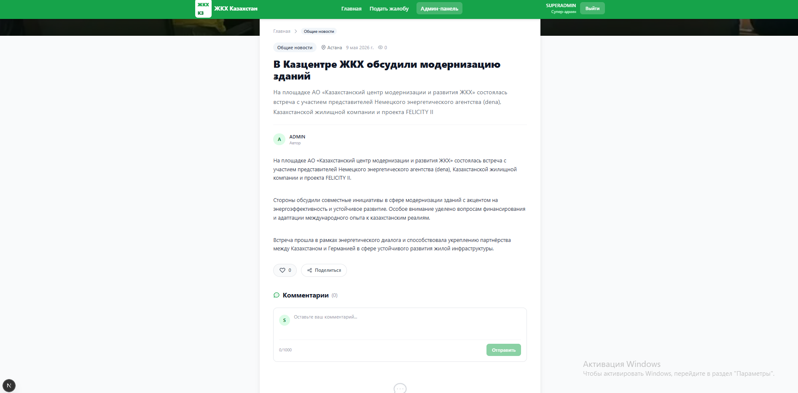
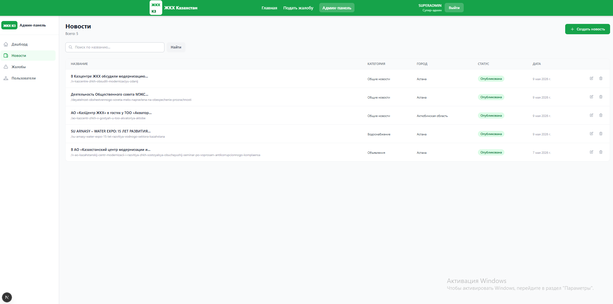
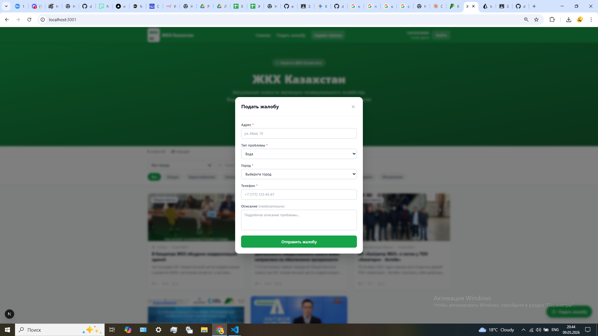

<div align="center">

# 🏠 ZhKH KZ — Kazakhstan Housing News Portal

**Fullstack application for publishing housing & utilities news and submitting complaints**

[](https://nextjs.org/)
[](https://nestjs.com/)
[](https://www.typescriptlang.org/)
[](https://www.postgresql.org/)
[](https://www.prisma.io/)

[🚀 Live Demo](https://news-fullstack.vercel.app) · [📖 API Docs](https://news-fullstack-production.up.railway.app/docs) · [🐛 Report a Bug](https://github.com/daniyaredigeev/News-Fullstack/issues)

</div>

---

## 📸 Screenshots

<div align="center">

| Home Page | Article Page |
|:---:|:---:|
|  |  |

| Admin Dashboard | Complaint Form |
|:---:|:---:|
|  |  |

</div>

---

## ✨ Features

### For Users
- 📰 News feed with filtering by **city**, **category**, and **tags**
- 🔍 Full-text search across title and content
- ❤️ Likes and comments on articles
- 📋 Submit housing complaints (anonymously or authenticated)
- 👤 Personal profile page

### For Admins
- ✍️ Create, edit, and delete news articles
- 🖼️ Image upload via Cloudinary
- 📊 View and manage submitted complaints
- 👥 User management and role assignment *(Super Admin only)*

---

## 🛠️ Tech Stack

| Layer | Technology |
|-------|-----------|
| Frontend | Next.js 15 (App Router), TypeScript, Tailwind CSS |
| Backend | NestJS 11, TypeScript |
| Database | PostgreSQL 16 (Neon in production) |
| ORM | Prisma 7 |
| Auth | JWT — Access Token + Refresh Token (httpOnly cookie) |
| File Upload | Cloudinary |
| API Docs | Swagger / OpenAPI 3.0 |
| Frontend Deploy | Vercel |
| Backend Deploy | Railway |

---

## 📁 Repository Structure

```
News-Fullstack/
├── news-front/          # Next.js 15 frontend
│   ├── src/
│   │   ├── app/         # Pages (App Router)
│   │   ├── components/  # Reusable components
│   │   ├── contexts/    # AuthContext
│   │   ├── lib/         # API client
│   │   └── types/       # TypeScript types
│   └── .env.example
└── news-back/           # NestJS 11 backend
    ├── prisma/          # Schema, migrations, seed
    ├── src/
    │   ├── auth/        # JWT authentication
    │   ├── news/        # News CRUD
    │   ├── like/        # Likes
    │   ├── comment/     # Comments
    │   ├── complaint/   # Complaints
    │   ├── city/        # Cities reference
    │   ├── upload/      # Cloudinary upload
    │   └── users/       # User management
    └── .env.example
```

---

## 🗺️ Pages

| Route | Description | Access |
|-------|-------------|--------|
| `/` | News feed with filters and pagination | Public |
| `/news/[slug]` | Article detail page | Public |
| `/complaint` | Complaint submission form | Public |
| `/login` | Login page | Guest |
| `/register` | Registration page | Guest |
| `/profile` | User profile | USER+ |
| `/admin` | Admin dashboard | ADMIN+ |
| `/admin/news` | All articles including drafts | ADMIN+ |
| `/admin/news/create` | Create new article | ADMIN+ |
| `/admin/complaints` | View complaints | ADMIN+ |
| `/admin/users` | User management | SUPER_ADMIN |

---

## 📡 API Endpoints

### Auth
| Method | Path | Description | Access |
|--------|------|-------------|--------|
| POST | `/auth/register` | Register | Public |
| POST | `/auth/login` | Login | Public |
| POST | `/auth/logout` | Logout | Authenticated |
| POST | `/auth/refresh` | Refresh token | Public |
| GET | `/auth/me` | Current user | Authenticated |

### News
| Method | Path | Description | Access |
|--------|------|-------------|--------|
| GET | `/news` | Published feed (filters, pagination) | Public |
| GET | `/news/:slug` | Single article | Public |
| GET | `/news/admin/all` | All articles + drafts | ADMIN+ |
| POST | `/news` | Create article | ADMIN+ |
| PATCH | `/news/:id` | Update article | ADMIN+ |
| DELETE | `/news/:id` | Delete article | ADMIN+ |

### Other
| Method | Path | Description | Access |
|--------|------|-------------|--------|
| GET | `/cities` | List cities | Public |
| POST | `/upload/image` | Upload to Cloudinary | ADMIN+ |
| POST | `/like/:articleId` | Toggle like | USER+ |
| GET | `/comment/:articleId` | Get comments | Public |
| POST | `/comment/:articleId` | Add comment | USER+ |
| DELETE | `/comment/:id` | Delete comment | USER+ |
| POST | `/complaint` | Submit (anonymous) | Public |
| POST | `/complaint/auth` | Submit (authenticated) | USER+ |
| GET | `/complaint` | List complaints | ADMIN+ |
| GET | `/users` | List users | SUPER_ADMIN |
| PATCH | `/users/:id/role` | Change role | SUPER_ADMIN |
| DELETE | `/users/:id` | Delete user | SUPER_ADMIN |

> 📖 Full interactive docs at [`/docs`](https://news-fullstack-production.up.railway.app/docs)

---

## 🔐 User Roles

| Role | Permissions |
|------|------------|
| `USER` | Read, like, comment, submit complaints |
| `ADMIN` | All above + create/edit/delete articles |
| `SUPER_ADMIN` | All above + manage users |

---

## 🚀 Getting Started

### Prerequisites

- Node.js 20+
- PostgreSQL 16
- Cloudinary account

### Backend

```bash
git clone https://github.com/daniyaredigeev/News-Fullstack.git
cd News-Fullstack/news-back
npm install
cp .env.example .env
# fill in .env
npx prisma migrate dev
npm run seed
npm run start:dev
```

API: **http://localhost:3000**  
Swagger: **http://localhost:3000/docs**

### Frontend

```bash
cd News-Fullstack/news-front
npm install
cp .env.example .env.local
# set NEXT_PUBLIC_API_URL=http://localhost:3000
npm run dev
```

App: **http://localhost:3001**

---

## 👤 Author

**Daniyar Yedigeyev** — [github.com/daniyaredigeev](https://github.com/daniyaredigeev)

---

<div align="center">
Built as a Capstone Project | Fullstack Next.js + NestJS + PostgreSQL
</div>
